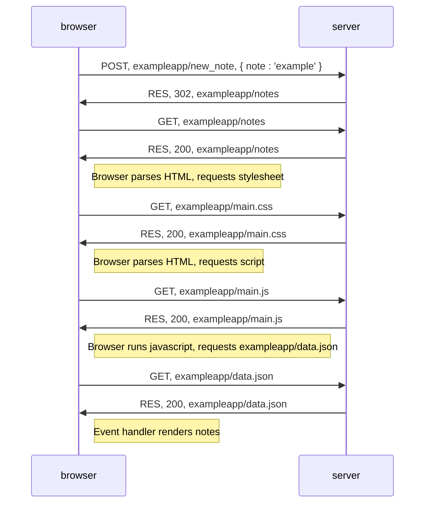

```mermaid
sequenceDiagram
browser->>server: POST, exampleapp/new_note, { note : 'example' }
server->>browser: RES, 302, exampleapp/notes
browser->>server: GET, exampleapp/notes
server->>browser: RES, 200, exampleapp/notes
Note right of browser: Browser parses HTML, requests stylesheet
browser->>server: GET, exampleapp/main.css
server->>browser: RES, 200, exampleapp/main.css
Note right of browser: Browser parses HTML, requests script
browser->>server: GET, exampleapp/main.js
server->>browser: RES, 200, exampleapp/main.js
Note right of browser: Browser runs javascript, requests exampleapp/data.json
browser->>server: GET, exampleapp/data.json
server->>browser: RES, 200, exampleapp/data.json
Note right of browser: Event handler renders notes
```
