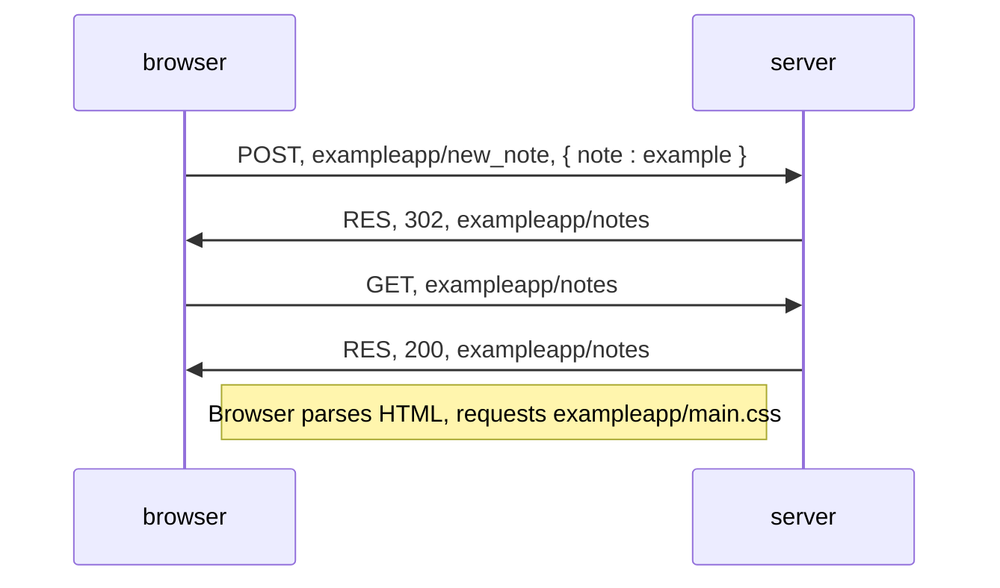

```mermaid
sequenceDiagram
browser->>server: POST, exampleapp/new_note, { note : example }
server->>browser: RES, 302, exampleapp/notes
browser->>server: GET, exampleapp/notes
server->>browser: RES, 200, exampleapp/notes
Note right of browser: Browser parses HTML, requests exampleapp/main.css
```
