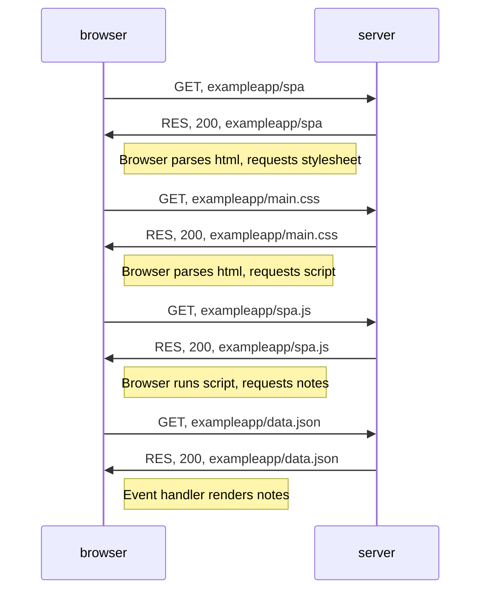

```mermaid
sequenceDiagram
browser->>server: GET, exampleapp/spa
server->>browser: RES, 200, exampleapp/spa
Note right of browser: Browser parses html, requests stylesheet
browser->>server: GET, exampleapp/main.css
server->>browser: RES, 200, exampleapp/main.css
Note right of browser: Browser parses html, requests script
browser->>server: GET, exampleapp/spa.js
server->>browser: RES, 200, exampleapp/spa.js
Note right of browser: Browser runs script, requests notes
browser->>server: GET, exampleapp/data.json
server->>browser: RES, 200, exampleapp/data.json
Note right of browser: Event handler renders notes
```
